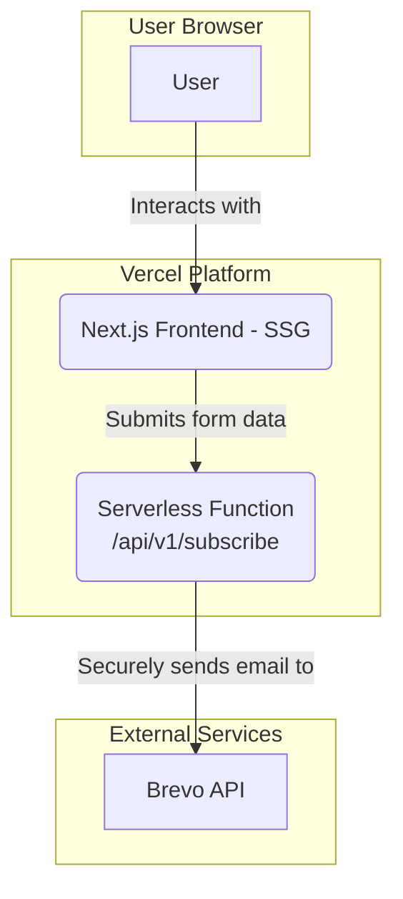
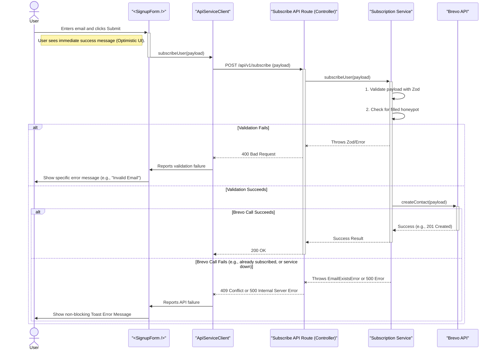

# Quando um amor se vai Fullstack Architecture Document

## 1. Introduction
This document outlines the complete fullstack architecture for the "Quando um amor se vai" project, including backend systems, frontend implementation, and their integration. It serves as the single source of truth for AI-driven development, ensuring consistency across the entire technology stack. This unified approach combines what would traditionally be separate backend and frontend architecture documents, streamlining the development process for modern fullstack applications where these concerns are increasingly intertwined.

### Starter Template or Existing Project
The project will be initialized using the standard **Next.js** starter template. Specifically, the command `npx create-next-app@latest` with TypeScript and Tailwind CSS flags will be used. This choice provides a production-ready foundation with a pre-configured React and Next.js environment, integrated TypeScript support, and Tailwind CSS setup for utility-first styling.

### Change Log
| Date | Version | Description | Author |
| :--- | :--- | :--- | :--- |
| 2025-10-06 | 1.0 | Initial architecture draft based on PRD v1.0 and UI/UX Spec v1.0 | Winston (Architect) |

## 2. High Level Architecture

### Technical Summary
The architecture for "Quando um amor se vai" is a modern, **serverless Jamstack** solution designed for high performance, low cost, and maintainability. The frontend is a multi-page static site built with **Next.js** and styled with **Tailwind CSS**, hosted on Vercel's global edge network. User interactions (email form submissions) are handled by a reusable and secure serverless function (a Next.js API route) that accepts parameters to direct subscriptions to the appropriate audience list in the external **Brevo API**. This approach ensures API credentials, managed via Vercel's environment variables, are never exposed on the client side. The entire system uses a shared-type monorepo to ensure data consistency between the frontend and backend, all deployed via an automated Git-based CI/CD workflow.

### Platform and Infrastructure Choice
* **Platform:** Vercel. Chosen for its seamless integration with Next.js and its generous free tier, meeting the core "cost-effectiveness" constraint.
* **Key Services:** Global Static Hosting, Serverless Functions, Integrated CI/CD.
* **Deployment Host and Regions:** Vercel's global edge network.

### Repository Structure
* **Structure:** Monorepo. The default Next.js project structure co-locates the frontend and serverless backend logic within a single repository, simplifying development and deployment.

### High Level Architecture Diagram


### Architectural Patterns

* **Serverless Architecture:** Backend logic is encapsulated in cost-effective, auto-scaling serverless functions.
* **Static Site Generation (SSG):** Pages are pre-rendered at build time for maximum performance, security, and SEO benefits.
* **API Façade:** The serverless function abstracts the Brevo API and protects sensitive credentials.
* **Component-Based UI:** The UI will be built from small, reusable components.
* **Shared-Type Monorepo Pattern:** Utilizes a shared package within the monorepo for TypeScript types (e.g., for form payloads) to ensure data consistency and type safety between the frontend and the serverless function's expected input.

## 3. Tech Stack

This table is the **DEFINITIVE** technology selection for the entire project. All development must use these specific choices and versions.

| Category | Technology | Version | Purpose | Rationale |
|:---|:---|:---|:---|:---|
| **Frontend Language** | TypeScript | \~5.x | Primary language for type safety. | Standard for modern Next.js development; ensures type safety. |
| **Frontend Framework** | Next.js (React) | \~14.x | Core framework for SSG and API Routes. | Enables SSG for performance; integrated architecture. |
| **UI Component Library** | Shadcn/UI | \~0.x | Foundation for all UI components. | Accelerates development with accessible, themeable components. |
| **UI Primitives** | Radix UI | \~1.x | Accessible, headless primitives. | Foundation of Shadcn/UI, providing best-in-class accessibility. |
| **State Management** | React Context/Hooks | (built-in) | Managing simple, localized UI state. | Sufficient for the MVP; avoids adding external libraries. |
| **Backend Language** | TypeScript | \~5.x | Language for the serverless API function. | Ensures end-to-end type safety when used with Next.js. |
| **Backend Framework** | Next.js API Routes | \~14.x | Framework for the serverless function. | Integrated directly into the Next.js project. |
| **API Style** | REST | n/a | Standard for the single API endpoint. | Simple RESTful endpoint is sufficient. |
| **Database** | None | n/a | No database is required for the MVP. | All data sent directly to the external Brevo API. |
| **Email API** | Brevo | (API) | External service for managing email lists. | Selected for its generous free tier. |
| **Email SDK** | @getbrevo/brevo | \~7.x | Official Node.js SDK for API communication. | Provides pre-built, typed methods for reliable integration. |
| **Validation** | Zod | \~3.x | Runtime and compile-time validation. | Single source of truth for schema validation across the full stack. |
| **Form Management** | React Hook Form | \~7.x | For managing form state and validation. | Robust and performant form handling. |
| **Frontend Testing** | Jest, React Testing Library, jest-axe | \~29.x | For unit and integration testing of UI components. | Standard for testing React applications. |
| **E2E Testing** | Cypress, cypress-axe | \~13.x | For end-to-end testing of user flows. | Ensures the signup flow works correctly in a real browser. |
| **CI/CD** | Vercel | (platform) | Automated builds and deployments from Git. | Seamless, zero-configuration CI/CD pipeline. |
| **CSS Framework** | Tailwind CSS | \~3.x | For utility-first styling. | Speed of development and maintainability. |
| **Animation** | Framer Motion | \~11.x | For page transitions and micro-interactions. | Powerful library that respects prefers-reduced-motion. |

## 4. Data Models

The primary data structure is the payload sent from the client to our serverless API function. The Zod schema is the single source of truth for both validation and TypeScript typing.

### Schema and Type Definition (Single Source of Truth)

```typescript
// Located in the shared package: /shared/schemas.ts
import { z } from 'zod';

// Zod schema is the single source of truth for validation rules.
export const subscriptionPayloadSchema = z.object({
  email: z.string().email({ message: "Invalid email address." }),
  listName: z.enum(['tutors', 'vets']),
  honeypot: z.string().max(0, { message: "Bot submission detected." }).optional(),
});

// The TypeScript type is inferred directly from the schema, eliminating drift.
export type SubscriptionPayload = z.infer<typeof subscriptionPayloadSchema>;
```

## 5. API Specification

The API uses a unified `ApiResponse` envelope and is versioned at `/api/v1` for future scalability.

### REST API Specification

```yaml
openapi: 3.0.0
info:
  title: "Quando um amor se vai API"
  version: "1.0.0"
  description: "API for handling email subscriptions."
servers:
  - url: "/api/v1"
    description: "Version 1 of the API"
paths:
  /subscribe:
    post:
      summary: "Subscribes a user to a mailing list (Tutors or Vets)."
      operationId: subscribeUser
      requestBody:
        required: true
        content:
          application/json:
            schema:
              $ref: '#/components/schemas/SubscriptionPayload'
      responses:
        '200':
          description: "Subscription successful."
          content:
            application/json:
              schema:
                $ref: '#/components/schemas/ApiResponse'
        '400':
          description: "Bad Request - Validation or Honeypot failed."
          content:
            application/json:
              schema:
                $ref: '#/components/schemas/ApiResponse'
        '409':
          description: "Conflict - The email address is already subscribed."
          content:
            application/json:
              schema:
                $ref: '#/components/schemas/ApiResponse'
        '500':
          description: "Internal Server Error - Unexpected failure."
          content:
            application/json:
              schema:
                $ref: '#/components/schemas/ApiResponse'
components:
  schemas:
    SubscriptionPayload:
      type: object
      required: [email, listName]
      properties:
        email:
          type: string
          format: email
        listName:
          type: string
          enum: [tutors, vets]
        honeypot:
          type: string
          maxLength: 0
    ApiResponse:
      type: object
      properties:
        data:
          type: object
          nullable: true
        error:
          $ref: '#/components/schemas/ApiError'
          nullable: true
    ApiError:
      type: object
      properties:
        code:
          type: string
        message:
          type: string
        details:
          type: array
          items:
            type: object
          nullable: true
```

## 6. Components

The architecture is divided into three logical groups: Base UI (Shadcn/UI), Composite UI (Feature-specific), and Services/Shared.

### Base UI Components (via Shadcn/UI)

* **Button**: A polymorphic button component.
* **Form Primitives (Input, Label)**: Accessible foundation for forms.

### Composite UI Components (Frontend)

* **<Layout />**: Provides the primary, themeable page structure, including the header and footer.
* **<SignupForm />**: Manages the email subscription process. Built from Base UI components and uses React Hook Form.
* **<Analytics />**: Integrates and manages the Google Analytics script and page view tracking.

### Services & Shared Packages

* **ApiServiceClient (Frontend Service)**: A dedicated client-side module for all communication with the backend API. It handles the `fetch` call and response parsing.
* **Subscribe API Route (Backend Controller)**: The HTTP layer that handles request I/O and calls the subscription service.
* **Subscription Service (Backend Service)**: The business logic layer that performs validation, honeypot check, and Brevo SDK call.
* **Shared Schemas & Types (Shared Package)**: The single source of truth for data structures and validation schemas.

### Component Interaction Diagram (Refined)

```mermaid
graph TD
subgraph Frontend (Browser)
Composite["<SignupForm />"] -->|Built With| Base["<Input />, <Button />"]
Composite -->|Uses for API Calls| Service["ApiServiceClient"]
Composite -->|Uses for Validation| Shared["Shared Schemas & Types"]
Service -->|Imports Types| Shared
end

subgraph Backend (Vercel)
    Controller["Subscribe API Route"] -->|Imports Schemas| Shared
    Controller -->|Calls Business Logic| SubsService["Subscription Service"]
    SubsService -->|Uses SDK| SDK["@getbrevo/brevo"]
end

subgraph External
    Brevo["Brevo API"]
end

Service --"POST /api/v1/subscribe"--> Controller
SDK --> Brevo
```

## 7. External APIs

### Brevo API

* **Purpose:** To add new contacts to the "Tutors" and "Vets" email marketing lists.
* **Authentication:** API Key stored as a server-side environment variable: `BREVO_API_KEY`.
* **Configuration:** Specific list IDs must be stored as environment variables: `BREVO_TUTORS_LIST_ID` and `BREVO_VETS_LIST_ID`.
* **Error Handling:** The **Subscription Service** must map Brevo's "contact already exists" error to our custom `EmailExistsError`, which the Controller then maps to a **409 Conflict** response.

## 8. Core Workflows

### User Subscription Workflow (All Paths)



## 9. Database Schema

No database schema is defined as **no database is required** for the MVP.

## 10. Frontend Architecture

### Component Architecture

* **Component Organization:** Uses a clean `src/components/ui` (for Shadcn/UI) and `src/components/composite` (for feature components) structure.
* **Component Template:** Components default to **React Server Components (RSC)**. The `"use client";` directive must be added only when client-side interactivity (hooks, event handlers) is required.

### Routing Architecture

* **Pattern:** Next.js **App Router** (`/app` directory) based routing.
* **Organization:** Routes are defined by `page.tsx` and API endpoints by `route.ts` files within the `app` directory.

### Frontend Services Layer

The API Client is designed to be robust, handling network errors and the unified `ApiResponse` envelope gracefully.

## 11. Backend Architecture

### Service Architecture

* **Pattern:** **Serverless Architecture** using Next.js API Routes.
* **Separation of Concerns:** Logic is strictly separated:
  * **Controller (**`route.ts`): Handles HTTP I/O, error mapping, and calls the service.
  * **Service (**`subscriptionService.ts`): Contains all business logic (validation, honeypot, Brevo call).

## 12. Unified Project Structure

```plaintext
/quandounamorsevai
├── src/
│   ├── app/                      # Next.js App Router (FE/BE entry points)
│   │   ├── layout.tsx            # Root Layout
│   │   └── api/
│   │       └── v1/
│   │           └── subscribe/
│   │               └── route.ts  # API Controller
│   ├── components/               # All reusable FE components
│   │   ├── ui/                   # Shadcn/UI primitives
│   │   └── composite/            # Feature-specific components
│   ├── services/                 # FE/BE Business Logic & API Clients
│   │   ├── subscriptionService.ts# Backend Service
│   │   └── apiClient.ts          # Frontend API Client
│   ├── utils/                    # Generic utilities (e.g., error handling)
│   └── shared/                   # Monorepo boundary for shared types
│       └── schemas.ts            # Zod & TypeScript Schemas/Types (CRITICAL)
├── .env.example                  # Documents required environment variables
├── package.json                  
└── tsconfig.json                 
```

## 13. Deployment Architecture

* **Platform:** Vercel.
* **Strategy:** SSG for frontend, Serverless Functions for backend.
* **CI/CD:** Automated Git-based pipeline.

## 14. Testing Strategy

* **Pyramid:** Unit, Integration, and E2E (Cypress) tests.
* **E2E:** Cypress and `cypress-axe` will test the full user journey and accessibility compliance.


