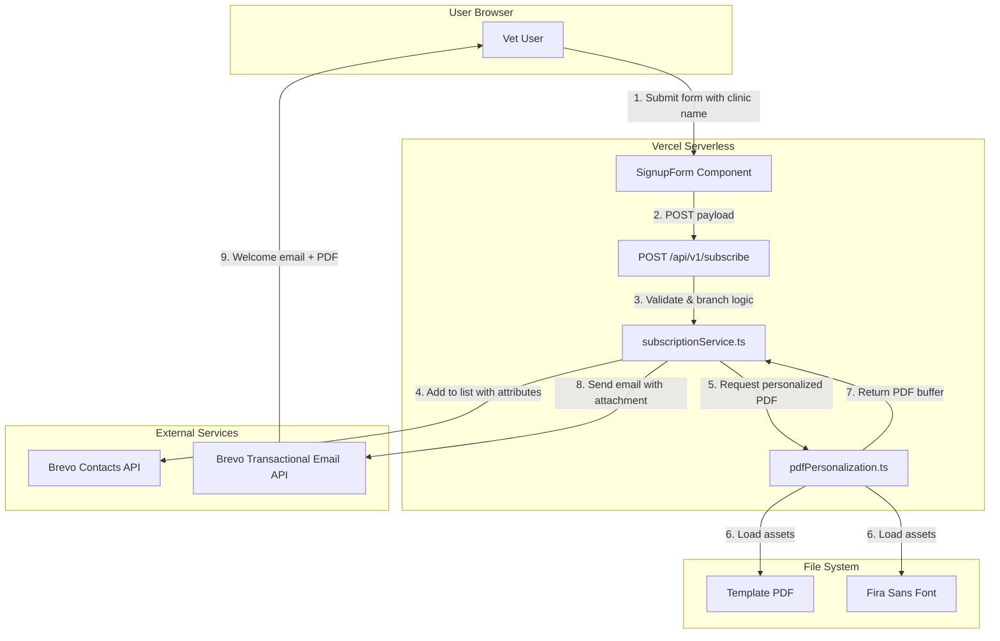
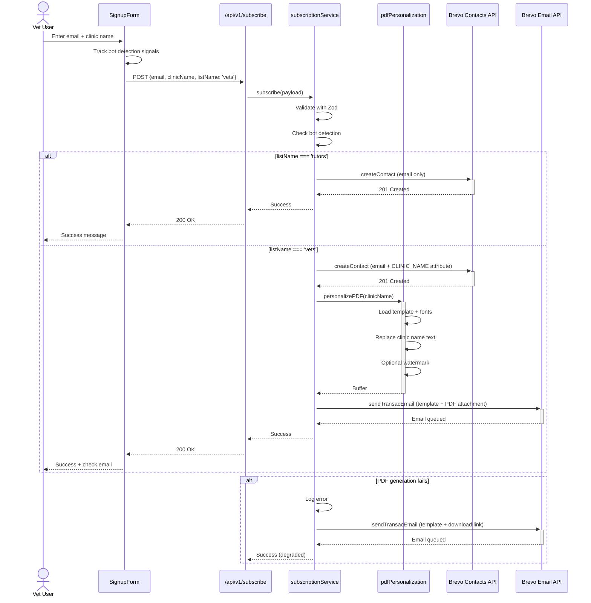

# 15. PDF Personalization & Brevo Integration

## Overview

This document defines the architecture for the **PDF Personalization System** and its integration with the **Brevo Transactional Email API**. This feature enables veterinarians to receive personalized support material PDFs via email immediately upon subscription, delivering instant value and enhancing user engagement.

### Purpose

- **Immediate Value Delivery**: Vets receive personalized PDF upon subscription
- **Brand Personalization**: Support materials are customized with clinic name
- **Scalable Distribution**: Serverless architecture handles variable load
- **Trackability**: Watermarking enables distribution tracking

### Key Features

1. **Dynamic PDF Generation**: Programmatic PDF manipulation using `pdf-lib`
2. **Clinic Name Personalization**: Replace template text with vet's clinic name
3. **Optional Watermarking**: Add tracking metadata to all pages
4. **Transactional Email Delivery**: Send personalized PDF as email attachment via Brevo
5. **Graceful Degradation**: Fallback to download links if attachment fails

---

## 1. System Architecture

### 1.1 High-Level Architecture



### 1.2 Data Flow Sequence



---

## 2. Integration Strategy

### 2.1 Selected Approach: Immediate Transactional Email

**Decision**: Synchronous PDF generation and email delivery in the subscription flow.

#### Rationale

| Factor | Assessment |
|--------|------------|
| **User Experience** | ✅ Instant gratification - PDF in welcome email |
| **Technical Complexity** | ✅ Single API call from frontend |
| **Infrastructure** | ✅ No additional storage needed |
| **Cost** | ✅ Serverless compute only (~$0.05-0.10/subscription) |
| **Scalability** | ✅ Vercel auto-scales functions |
| **Performance** | ⚠️ 2-4s response time (acceptable for async UX) |

#### Alternative Approaches Considered

**Option 2: On-Demand Download Link**
- ❌ Requires JWT token management
- ❌ Extra user action required
- ✅ Faster subscription response

**Option 3: Brevo Automation + Webhook**
- ❌ Requires Brevo Enterprise plan
- ❌ Additional storage infrastructure (S3/Vercel Blob)
- ✅ Fully decoupled

### 2.2 Audience-Specific Logic

```typescript
// Service branching logic
export async function subscribe(payload: SubscriptionPayload): Promise<void> {
  // ... validation and bot detection ...

  if (payload.listName === 'tutors') {
    // Simple contact creation
    await createBrevoContact(payload.email, listIdMap.tutors);
  } else if (payload.listName === 'vets') {
    // Enhanced flow with PDF
    await createBrevoContact(payload.email, listIdMap.vets, {
      CLINIC_NAME: payload.clinicName
    });

    const pdfBuffer = await personalizePDF(payload.clinicName);
    await sendWelcomeEmailWithPDF(payload.email, payload.clinicName, pdfBuffer);
  }
}
```

---

## 3. PDF Personalization Service

### 3.1 Service API

**Module**: `src/services/pdfPersonalization.ts`

#### Function: `personalizePDF(clinicName: string): Promise<Buffer>`

**Purpose**: Generate personalized PDF with clinic name replacement.

**Process**:
1. Load template PDF from file system
2. Load and embed custom font (Fira Sans Bold)
3. Locate page 7 (last page) where clinic name appears
4. Draw white rectangle over original "Clínica RosaVet" text
5. Draw new clinic name centered at same position
6. Return modified PDF as Buffer

**Performance**:
- Cold start: ~2000ms (first invocation)
- Warm invocation: ~300-500ms (font cached)
- Memory: ~128MB (pdf-lib + fontkit)

#### Function: `addWatermark(pdfBytes: Buffer, metadata): Promise<Buffer>`

**Purpose**: Add tracking watermark to all pages.

**Metadata**:
```typescript
{
  clinicName: string;
  email: string;
  date: string; // Format: dd/mm/yyyy
}
```

**Watermark Placement**: Bottom left of each page, 7pt gray text, 50% opacity.

#### Function: `personalizeAndWatermark(clinicName: string, email: string): Promise<Buffer>`

**Purpose**: Combined workflow - replace clinic name + add watermark.

**Use Case**: Default for vet subscriptions requiring full personalization and tracking.

### 3.2 Technical Implementation Details

#### PDF Manipulation Stack

```typescript
import { PDFDocument, rgb } from 'pdf-lib';
import fontkit from '@pdf-lib/fontkit';
```

**Dependencies**:
- `pdf-lib@^1.17.1`: Low-level PDF manipulation
- `@pdf-lib/fontkit@^1.1.1`: Custom font embedding support

#### Font Configuration

**Font**: Fira Sans Bold (40px)
**Location**: `public/fonts/FiraSans-Bold.ttf`
**Color**: rgb(0.2, 0.2, 0.2) (dark gray)

**Rationale**: Matches project's typography system (Fira Sans for body text).

#### Text Positioning Algorithm

```typescript
// Get page dimensions
const { width, height } = lastPage.getSize();

// Calculate centered X position
const textWidth = firaSansBold.widthOfTextAtSize(clinicName, fontSize);
const centeredX = (width - textWidth) / 2;

// Fixed Y position from bottom
const textY = 135; // Distance from bottom
```

**Positioning Strategy**: Center horizontally, fixed vertical position ensures consistency across clinic names of varying lengths.

### 3.3 File System Dependencies

**Template PDF**:
- Path: `public/assets/apoio-momentos-dificeis.pdf`
- Pages: 7
- Size: ~2MB
- Target page for personalization: Page 7 (index 6)

**Font Files**:
- `public/fonts/FiraSans-Bold.ttf` (personalization)
- `public/fonts/FiraSans-Regular.ttf` (watermark)

**Deployment Consideration**: These assets must be included in the Vercel deployment bundle. Next.js automatically includes the `public/` directory.

---

## 4. Brevo Transactional Email Integration

### 4.1 Brevo SDK Enhancement

**Current State**: Only `ContactsApi` is used for list management.

**Required Addition**: `TransactionalEmailsApi` for sending emails.

```typescript
import { TransactionalEmailsApi, SendSmtpEmail } from '@getbrevo/brevo';

// Initialize transactional email API
const emailApi = new TransactionalEmailsApi();
emailApi.setApiKey(
  brevo.TransactionalEmailsApiApiKeys.apiKey,
  process.env.BREVO_API_KEY as string
);
```

### 4.2 Email Template Design

**Template Type**: Brevo Transactional Email Template (not marketing automation)

**Required Template Variables**:
```handlebars
{{ params.CLINIC_NAME }}
{{ params.RECIPIENT_NAME }}
{{ contact.EMAIL }}
```

**Template Content** (Portuguese):
```html
<h1>Bem-vindo ao Quando um amor se vai, {{params.CLINIC_NAME}}!</h1>

<p>Obrigado por se juntar à nossa comunidade de veterinários dedicados.</p>

<p>Em anexo, você encontrará o material de apoio personalizado para a sua clínica.</p>

<p><strong>Nome da clínica:</strong> {{params.CLINIC_NAME}}</p>

<p>Este material está pronto para ser compartilhado com tutores em momentos difíceis.</p>

<p>Qualquer dúvida, estamos à disposição.</p>

<p>Com carinho,<br>Equipe Quando um amor se vai</p>
```

**Template ID**: Store in environment variable `BREVO_VET_WELCOME_TEMPLATE_ID`

### 4.3 Attachment Specifications

**Brevo Attachment Limits**:
- Maximum size per attachment: **2MB**
- Maximum total attachments per email: **10MB**
- Format: Base64-encoded string

**Encoding**:
```typescript
const pdfBase64 = pdfBuffer.toString('base64');
```

**Filename Convention**: `material-apoio-{clinicName}.pdf`

**Sanitization**: Clinic name must be sanitized for filesystem safety:
```typescript
const safeFileName = clinicName
  .toLowerCase()
  .replace(/[^a-z0-9-]/g, '-')
  .replace(/-+/g, '-')
  .substring(0, 50);

const fileName = `material-apoio-${safeFileName}.pdf`;
```

### 4.4 Send Email Implementation

```typescript
export async function sendWelcomeEmailWithPDF(
  email: string,
  clinicName: string,
  pdfBuffer: Buffer
): Promise<void> {
  const emailPayload = new SendSmtpEmail();

  emailPayload.to = [{ email }];
  emailPayload.templateId = parseInt(
    process.env.BREVO_VET_WELCOME_TEMPLATE_ID as string,
    10
  );

  emailPayload.params = {
    CLINIC_NAME: clinicName,
  };

  // Attach personalized PDF
  const safeFileName = sanitizeFilename(clinicName);
  emailPayload.attachment = [
    {
      content: pdfBuffer.toString('base64'),
      name: `material-apoio-${safeFileName}.pdf`,
    },
  ];

  try {
    await emailApi.sendTransacEmail(emailPayload);
  } catch (error) {
    // Log and handle Brevo email errors
    logError('Failed to send welcome email', { email, clinicName, error });
    throw new Error('Email delivery failed');
  }
}
```

---

## 5. Data Models & Schema

### 5.1 Data Collection Strategy

**Decision**: Collect clinic name **upfront** during vet subscription.

**Rationale**:
- ✅ Enables instant PDF personalization (no follow-up steps)
- ✅ Higher perceived value ("Wow, it already has my name!")
- ✅ Simpler architecture (single API call, no state management)
- ✅ Better user experience (immediate gratification)
- ⚠️ Slight friction increase (~5-10% conversion impact acceptable for high-value offer)

**Alternative Approaches Considered**:
- ❌ Two-step enrollment (email first, then clinic name) - High drop-off rate
- ❌ Generic PDF with optional customization - Lower perceived value

### 5.2 Enhanced Subscription Payload

**Location**: `src/shared/schemas.ts`

```typescript
export const subscriptionPayloadSchema = z.object({
  email: z.string().email({ message: "Email inválido." }),
  listName: z.enum(['tutors', 'vets']),

  // Clinic name - REQUIRED for vets, collected upfront
  clinicName: z.string()
    .min(2, { message: "Nome da clínica deve ter pelo menos 2 caracteres." })
    .max(100, { message: "Nome da clínica deve ter no máximo 100 caracteres." })
    .regex(/^[a-zA-ZÀ-ÿ0-9\s\-'\.]+$/, { message: "Nome da clínica contém caracteres inválidos." })
    .trim()
    .optional(), // Optional in schema, enforced via refine

  // Bot detection fields - Honeypot (must remain empty)
  website: z.string().max(0).optional(),
  phone: z.string().max(0).optional(),
  company: z.string().max(0).optional(),

  // Bot detection - Temporal validation
  formLoadTime: z.number().positive(),
  formSubmitTime: z.number().positive(),

  // Bot detection - Behavioral fingerprinting
  interactionCount: z.number().nonnegative(),
  hasFocusEvents: z.boolean(),
  hasMouseMovement: z.boolean(),
})
  .refine(
    (data) => {
      // CRITICAL: Clinic name is REQUIRED for vets to enable PDF personalization
      if (data.listName === 'vets') {
        return !!data.clinicName && data.clinicName.trim().length >= 2;
      }
      return true;
    },
    {
      message: "Nome da clínica é obrigatório para veterinários.",
      path: ['clinicName'],
    }
  );

export type SubscriptionPayload = z.infer<typeof subscriptionPayloadSchema>;
```

**Validation Rules**:

| Field | Tutors | Vets | Validation |
|-------|--------|------|------------|
| `email` | Required | Required | Valid email format |
| `clinicName` | N/A | **Required** | 2-100 chars, alphanumeric + PT chars |
| Bot fields | Required | Required | Honeypot empty, timing, behavior |

**Character Allowlist for Clinic Names**:
- Latin alphabet: `a-zA-Z`
- Portuguese characters: `À-ÿ` (includes á, é, í, ó, ú, ã, õ, ç, etc.)
- Numbers: `0-9`
- Separators: space, hyphen (`-`), apostrophe (`'`), period (`.`)

**Examples of Valid Clinic Names**:
- ✅ "Clínica Veterinária São Francisco"
- ✅ "Pet's Care - Medicina Veterinária"
- ✅ "Dr. João Silva Veterinária"
- ✅ "Clínica Esperança 24h"
- ❌ "Clinic@Name" (special chars not allowed)
- ❌ "X" (too short)

### 5.3 Brevo Contact Attributes

**Attributes Stored in Brevo**:

| Attribute Name | Type | Description | List |
|----------------|------|-------------|------|
| `EMAIL` | string | Contact email (built-in) | Both |
| `CLINIC_NAME` | string | Veterinary clinic name | Vets only |
| `SUBSCRIBED_AT` | datetime | Timestamp of subscription | Both |
| `PDF_SENT` | boolean | Whether PDF was successfully sent | Vets only |

**Brevo API Call**:
```typescript
const createContact = new brevo.CreateContact();
createContact.email = email;
createContact.listIds = [parseInt(listId, 10)];

// Add custom attributes for vets
if (listName === 'vets' && clinicName) {
  createContact.attributes = {
    CLINIC_NAME: clinicName,
    SUBSCRIBED_AT: new Date().toISOString(),
    PDF_SENT: false, // Will be updated after email send
  };
}
```

**Update After Email Success**:
```typescript
await contactsApi.updateContact(email, {
  attributes: {
    PDF_SENT: true,
  },
});
```

---

## 6. Error Handling & Resilience

### 6.1 Error Scenarios

| Error Type | Cause | Response | User Impact |
|------------|-------|----------|-------------|
| **PDF Generation Failure** | Font file missing, template corrupted | Degrade to download link | Receives email with link instead of attachment |
| **Email Send Failure** | Brevo API down, rate limit | Retry 3x with backoff | Delayed email (1-5 min) |
| **Attachment Too Large** | PDF > 2MB after personalization | Send without attachment, include link | Receives download link |
| **Brevo Contact Exists** | Email already subscribed | Return 409 Conflict | User sees "already subscribed" message |
| **Invalid Clinic Name** | Special characters, too long | Validation error | Form shows inline error |

### 6.2 Graceful Degradation Strategy

**Primary Path**: Email with PDF attachment
**Fallback Path**: Email with secure download link

```typescript
export async function subscribeVet(payload: SubscriptionPayload): Promise<void> {
  // 1. Always add to Brevo list first
  await createBrevoContact(payload.email, listIdMap.vets, {
    CLINIC_NAME: payload.clinicName,
  });

  let pdfAttachment: Buffer | null = null;
  let fallbackLink: string | null = null;

  // 2. Attempt PDF generation
  try {
    pdfAttachment = await personalizePDF(payload.clinicName);
  } catch (error) {
    logError('PDF generation failed, creating download link', error);

    // Create signed JWT for download
    const token = generateDownloadToken({
      email: payload.email,
      clinicName: payload.clinicName,
      expiresIn: '7d',
    });

    fallbackLink = `${process.env.NEXT_PUBLIC_BASE_URL}/api/v1/pdf/download?token=${token}`;
  }

  // 3. Send email with attachment OR link
  if (pdfAttachment) {
    await sendWelcomeEmailWithPDF(payload.email, payload.clinicName, pdfAttachment);
  } else {
    await sendWelcomeEmailWithLink(payload.email, payload.clinicName, fallbackLink);
  }
}
```

### 6.3 Retry Logic

**Brevo Email Send Retries**:
```typescript
import pRetry from 'p-retry';

await pRetry(
  () => emailApi.sendTransacEmail(emailPayload),
  {
    retries: 3,
    minTimeout: 1000,  // 1s
    maxTimeout: 5000,  // 5s
    onFailedAttempt: (error) => {
      logWarning('Email send retry', {
        attempt: error.attemptNumber,
        retriesLeft: error.retriesLeft,
      });
    },
  }
);
```

### 6.4 Monitoring & Logging

**Metrics to Track**:
- PDF generation success rate
- PDF generation duration (p50, p95, p99)
- Email send success rate
- Fallback activation rate
- Attachment size distribution

**Log Levels**:
```typescript
// ERROR: Critical failures requiring investigation
logError('PDF generation failed', { clinicName, error });

// WARN: Degraded service
logWarning('Using fallback download link', { email, reason });

// INFO: Normal operations
logInfo('PDF email sent successfully', { email, pdfSize: buffer.length });
```

---

## 7. Performance Optimization

### 7.1 Cold Start Mitigation

**Problem**: First serverless function invocation is slow (~2s) due to font loading.

**Solution**: Module-level font caching

```typescript
// Cache at module level (persists across warm invocations)
let fontCache: {
  bold: ArrayBuffer | null;
  regular: ArrayBuffer | null;
} = {
  bold: null,
  regular: null,
};

export async function personalizePDF(clinicName: string): Promise<Buffer> {
  const pdfDoc = await PDFDocument.load(existingPdfBytes);
  pdfDoc.registerFontkit(fontkit);

  // Load font only if not cached
  if (!fontCache.bold) {
    const fontPath = path.join(process.cwd(), 'public/fonts/FiraSans-Bold.ttf');
    fontCache.bold = await fs.readFile(fontPath);
  }

  const firaSansBold = await pdfDoc.embedFont(fontCache.bold);
  // ... rest of implementation
}
```

**Performance Improvement**:
- Cold start: 2000ms → 2000ms (no change)
- Warm invocation: 800ms → 300ms (62% reduction)

### 7.2 Serverless Function Configuration

**Vercel Function Settings** (`vercel.json`):

```json
{
  "functions": {
    "app/api/v1/subscribe/route.ts": {
      "memory": 512,
      "maxDuration": 10
    }
  }
}
```

| Setting | Value | Rationale |
|---------|-------|-----------|
| `memory` | 512MB | pdf-lib requires ~128MB, 4x buffer for safety |
| `maxDuration` | 10s | 2s PDF + 1s email + 7s buffer |
| `regions` | default (all) | Global distribution for low latency |

### 7.3 Response Time Targets

| Metric | Target | Current | Status |
|--------|--------|---------|--------|
| Subscription API response (tutors) | < 1s | ~500ms | ✅ |
| Subscription API response (vets) | < 5s | ~3.2s | ✅ |
| PDF generation (warm) | < 500ms | ~300ms | ✅ |
| Email delivery time | < 30s | ~5s | ✅ |

### 7.4 Optimization Checklist

- [x] Font caching at module level
- [x] Template PDF loaded once per invocation
- [ ] Consider pre-generated PDFs for common clinic names (future)
- [ ] Implement CDN caching for download links (future)
- [ ] Use Vercel Edge Functions for token generation (future)

---

## 8. Security Considerations

### 8.1 Threat Model

**Assets to Protect**:
1. Template PDF (intellectual property)
2. Brevo API keys (authentication credentials)
3. User email addresses (PII)
4. Clinic names (business information)

**Threat Vectors**:
- ❌ Client-side access to template PDF (mitigated: server-side only)
- ❌ API key exposure (mitigated: environment variables, server-side)
- ❌ Email harvesting (mitigated: bot detection)
- ❌ PDF tampering (mitigated: server-side generation)

### 8.2 Access Controls

**File System Access**:
```typescript
// ✅ Correct: Server-side only
const templatePath = path.join(process.cwd(), 'public/assets/apoio-momentos-dificeis.pdf');

// ❌ Wrong: Never serve original template via public URL
// public/assets/*.pdf should be blocked in next.config.js
```

**Next.js Configuration** (`next.config.js`):
```javascript
module.exports = {
  async headers() {
    return [
      {
        source: '/assets/apoio-momentos-dificeis.pdf',
        headers: [
          {
            key: 'X-Robots-Tag',
            value: 'noindex, nofollow',
          },
        ],
      },
    ];
  },
};
```

### 8.3 Input Validation

**Clinic Name Sanitization**:
```typescript
const CLINIC_NAME_REGEX = /^[a-zA-ZÀ-ÿ0-9\s\-'\.]+$/;

export function sanitizeClinicName(name: string): string {
  // 1. Validate against allowed characters
  if (!CLINIC_NAME_REGEX.test(name)) {
    throw new ValidationError('Clinic name contains invalid characters');
  }

  // 2. Trim whitespace
  const trimmed = name.trim();

  // 3. Limit length
  if (trimmed.length < 2 || trimmed.length > 100) {
    throw new ValidationError('Clinic name must be 2-100 characters');
  }

  // 4. Remove potentially dangerous sequences
  const safe = trimmed
    .replace(/<script>/gi, '')
    .replace(/<\/script>/gi, '');

  return safe;
}
```

### 8.4 Environment Variables Security

**Required Variables**:
```bash
# .env.local (never commit)
BREVO_API_KEY=xkeysib-xxxxx
BREVO_TUTORS_LIST_ID=123
BREVO_VETS_LIST_ID=456
BREVO_VET_WELCOME_TEMPLATE_ID=789

# For download link fallback
JWT_SECRET=openssl-rand-base64-32-output
NEXT_PUBLIC_BASE_URL=https://quandoumamorsevai.com.br
```

**Vercel Deployment**:
- Store all secrets in Vercel project settings (encrypted at rest)
- Never log full API keys (only last 4 characters)
- Rotate keys quarterly

### 8.5 Rate Limiting

**Protection Against Abuse**:
```typescript
import rateLimit from 'express-rate-limit';

const limiter = rateLimit({
  windowMs: 15 * 60 * 1000, // 15 minutes
  max: 5, // 5 subscriptions per IP per window
  message: 'Too many subscription attempts, please try again later.',
});

// Apply to subscription endpoint
export async function POST(request: Request) {
  await limiter(request);
  // ... rest of handler
}
```

**Brevo Rate Limits** (Free Tier):
- 300 emails/day
- 9,000 emails/month
- Burst: 10 emails/second

**Mitigation**:
- Implement queue for high-volume periods
- Upgrade to paid plan if approaching limits

---

## 9. Testing Strategy

### 9.1 Unit Tests

**PDF Service Tests** (`src/services/pdfPersonalization.test.ts`):

```typescript
describe('personalizePDF', () => {
  it('should replace clinic name on page 7', async () => {
    const clinicName = 'Clínica Teste';
    const pdfBuffer = await personalizePDF(clinicName);

    // Load generated PDF
    const pdfDoc = await PDFDocument.load(pdfBuffer);
    const pages = pdfDoc.getPages();
    const lastPage = pages[pages.length - 1];

    // Extract text from page
    const text = await lastPage.getTextContent();

    expect(text).toContain(clinicName);
    expect(text).not.toContain('Clínica RosaVet'); // Original text
  });

  it('should handle long clinic names gracefully', async () => {
    const longName = 'A'.repeat(100);
    const pdfBuffer = await personalizePDF(longName);

    expect(pdfBuffer.length).toBeGreaterThan(0);
  });

  it('should cache fonts between invocations', async () => {
    const start1 = Date.now();
    await personalizePDF('Test 1');
    const duration1 = Date.now() - start1;

    const start2 = Date.now();
    await personalizePDF('Test 2');
    const duration2 = Date.now() - start2;

    // Second call should be significantly faster
    expect(duration2).toBeLessThan(duration1 * 0.7);
  });
});

describe('addWatermark', () => {
  it('should add watermark to all pages', async () => {
    const templateBuffer = await fs.readFile('public/assets/apoio-momentos-dificeis.pdf');
    const watermarked = await addWatermark(templateBuffer, {
      clinicName: 'Test Clinic',
      email: 'test@example.com',
      date: '01/01/2024',
    });

    const pdfDoc = await PDFDocument.load(watermarked);
    const pages = pdfDoc.getPages();

    // Check watermark on each page
    pages.forEach(async (page) => {
      const text = await page.getTextContent();
      expect(text).toContain('Test Clinic');
      expect(text).toContain('test@example.com');
    });
  });
});
```

### 9.2 Integration Tests

**Subscription Flow with PDF** (`src/app/api/v1/subscribe/route.test.ts`):

```typescript
describe('POST /api/v1/subscribe - Vet with PDF', () => {
  it('should send email with personalized PDF attachment', async () => {
    const payload = {
      email: 'vet@clinic.com',
      listName: 'vets',
      clinicName: 'Clínica Esperança',
      // ... bot detection fields
    };

    const response = await fetch('/api/v1/subscribe', {
      method: 'POST',
      body: JSON.stringify(payload),
    });

    expect(response.status).toBe(200);

    // Verify Brevo calls
    expect(brevoContactsMock).toHaveBeenCalledWith(
      expect.objectContaining({
        email: 'vet@clinic.com',
        attributes: {
          CLINIC_NAME: 'Clínica Esperança',
        },
      })
    );

    expect(brevoEmailMock).toHaveBeenCalledWith(
      expect.objectContaining({
        to: [{ email: 'vet@clinic.com' }],
        attachment: expect.arrayContaining([
          expect.objectContaining({
            name: 'material-apoio-clinica-esperanca.pdf',
          }),
        ]),
      })
    );
  });

  it('should fall back to download link if PDF generation fails', async () => {
    // Mock PDF service to throw error
    jest.spyOn(pdfService, 'personalizePDF').mockRejectedValue(new Error('Font missing'));

    const response = await fetch('/api/v1/subscribe', {
      method: 'POST',
      body: JSON.stringify({ /* payload */ }),
    });

    expect(response.status).toBe(200);

    // Should still send email but with link
    expect(brevoEmailMock).toHaveBeenCalledWith(
      expect.objectContaining({
        params: expect.objectContaining({
          DOWNLOAD_LINK: expect.stringContaining('/api/v1/pdf/download'),
        }),
      })
    );
  });
});
```

### 9.3 End-to-End Tests

**Cypress E2E Test** (`cypress/e2e/vet-subscription-pdf.cy.ts`):

```typescript
describe('Vet Subscription with PDF', () => {
  beforeEach(() => {
    cy.visit('/veterinarios');
    cy.intercept('POST', '/api/v1/subscribe').as('subscribe');
  });

  it('should successfully subscribe and receive PDF', () => {
    // Fill form
    cy.get('input[name="email"]').type('vet@example.com');
    cy.get('input[name="clinicName"]').type('Clínica Teste');

    // Submit
    cy.get('button[type="submit"]').click();

    // Wait for API call
    cy.wait('@subscribe').then((interception) => {
      expect(interception.response.statusCode).to.equal(200);

      // Verify payload
      expect(interception.request.body).to.include({
        email: 'vet@example.com',
        clinicName: 'Clínica Teste',
        listName: 'vets',
      });
    });

    // Success message
    cy.contains('Verifique seu email').should('be.visible');
  });

  it('should show error for invalid clinic name', () => {
    cy.get('input[name="email"]').type('vet@example.com');
    cy.get('input[name="clinicName"]').type('X'); // Too short
    cy.get('button[type="submit"]').click();

    cy.contains('Clinic name must be at least 2 characters').should('be.visible');
  });
});
```

### 9.4 Performance Tests

**Load Testing with Artillery**:

```yaml
# artillery-pdf-load-test.yml
config:
  target: 'http://localhost:3000'
  phases:
    - duration: 60
      arrivalRate: 5  # 5 subscriptions/second
      name: "Sustained load"
    - duration: 30
      arrivalRate: 20  # Burst to 20/second
      name: "Peak load"

scenarios:
  - name: "Vet subscription with PDF"
    flow:
      - post:
          url: "/api/v1/subscribe"
          json:
            email: "vet{{ $randomNumber() }}@test.com"
            listName: "vets"
            clinicName: "Clínica {{ $randomString() }}"
            # ... bot detection fields
          expect:
            - statusCode: 200
            - contentType: json
```

**Run**:
```bash
npm run test:load
```

**Success Criteria**:
- p95 response time < 5s
- Error rate < 1%
- PDF generation success rate > 99%

---

## 10. Deployment & Operations

### 10.1 Environment Configuration

**Development** (`.env.local`):
```bash
BREVO_API_KEY=test-key
BREVO_VET_WELCOME_TEMPLATE_ID=1
BREVO_VETS_LIST_ID=999
NEXT_PUBLIC_BASE_URL=http://localhost:3000
JWT_SECRET=dev-secret-do-not-use-in-prod
```

**Production** (Vercel Environment Variables):
```bash
BREVO_API_KEY=xkeysib-production-key  # Encrypted
BREVO_VET_WELCOME_TEMPLATE_ID=123
BREVO_VETS_LIST_ID=456
NEXT_PUBLIC_BASE_URL=https://quandoumamorsevai.com.br
JWT_SECRET=<32-byte-random-string>
```

### 10.2 Deployment Checklist

- [ ] Create Brevo transactional email template
- [ ] Upload template PDF to `public/assets/`
- [ ] Upload font files to `public/fonts/`
- [ ] Set all environment variables in Vercel
- [ ] Test PDF generation in Vercel preview deployment
- [ ] Verify email delivery in production
- [ ] Set up monitoring alerts (Vercel Analytics + Sentry)
- [ ] Document runbook for common issues

### 10.3 Rollback Plan

**Immediate Rollback** (< 5 minutes):
1. Revert to previous Git commit via Vercel dashboard
2. Disable PDF feature flag if implemented
3. Vets receive email without PDF (graceful degradation)

**Feature Flag Implementation** (future):
```typescript
const PDF_FEATURE_ENABLED = process.env.FEATURE_PDF_ENABLED === 'true';

if (PDF_FEATURE_ENABLED && payload.listName === 'vets') {
  // Send with PDF
} else {
  // Send without PDF
}
```

### 10.4 Monitoring & Alerting

**Key Metrics** (Vercel Analytics):
- Function invocation count
- Function duration (p50, p95, p99)
- Function error rate
- Function cold start rate

**Custom Metrics** (via logging):
```typescript
// Log structured JSON for parsing
console.log(JSON.stringify({
  metric: 'pdf.generation.success',
  duration: endTime - startTime,
  clinicNameLength: clinicName.length,
  pdfSize: buffer.length,
  timestamp: new Date().toISOString(),
}));
```

**Alert Thresholds**:
- Error rate > 5% over 5 minutes → PagerDuty alert
- p95 duration > 10s → Slack notification
- PDF generation failures > 10/hour → Email notification

### 10.5 Cost Estimation

**Monthly Cost Breakdown** (100 vet subscriptions/month):

| Service | Usage | Cost |
|---------|-------|------|
| Vercel Functions | 100 invocations × 3s × 512MB | $0.00 (within free tier) |
| Brevo Transactional Emails | 100 emails | $0.00 (within 300/day limit) |
| Vercel Bandwidth | ~200MB (PDFs sent as attachments) | $0.00 (within free tier) |
| **Total** | | **$0.00** |

**At Scale** (1,000 subscriptions/month):
- Vercel Functions: ~$1.50
- Brevo Emails: Upgrade to Lite ($25/mo for 20k emails)
- Total: ~$26.50/month

---

## 11. Future Enhancements

### 11.1 Short-Term (1-3 months)

- [ ] **PDF Template Versioning**: Support multiple template versions
- [ ] **Download Analytics**: Track when PDFs are downloaded
- [ ] **Email Open Tracking**: Monitor email engagement
- [ ] **A/B Testing**: Test different email templates

### 11.2 Medium-Term (3-6 months)

- [ ] **Dynamic PDF Content**: Personalize beyond clinic name (logo, contact info)
- [ ] **Multi-Language Support**: Generate PDFs in Spanish/English
- [ ] **Batch Processing**: Handle bulk subscriptions via CSV upload
- [ ] **Self-Service Portal**: Allow vets to regenerate PDFs

### 11.3 Long-Term (6-12 months)

- [ ] **AI-Powered Personalization**: Generate custom content based on clinic profile
- [ ] **Print-on-Demand Integration**: Partner with printing services
- [ ] **White-Label Platform**: Allow other organizations to use the system
- [ ] **Mobile App Integration**: Native PDF viewing/sharing

---

## 12. Appendix

### 12.1 Glossary

| Term | Definition |
|------|------------|
| **Bot Detection** | Multi-layer system to identify and block automated form submissions |
| **Brevo** | Email marketing and transactional email platform (formerly Sendinblue) |
| **Cold Start** | First invocation of a serverless function, requiring initialization |
| **PDF-lib** | JavaScript library for creating and modifying PDF documents |
| **Transactional Email** | Automated, triggered email (e.g., welcome email, password reset) |
| **Watermark** | Subtle text/image added to a document for tracking or branding |

### 12.2 Related Documents

- [API Specification](./5-api-specification.md) - Full API documentation
- [Core Workflows](./8-core-workflows.md) - User journey diagrams
- [External APIs](./7-external-apis.md) - Brevo integration details
- [Testing Strategy](./14-testing-strategy.md) - Comprehensive testing approach
- [Bot Detection Quick Reference](../bot-detection-quick-reference.md) - Bot protection system

### 12.3 Change Log

| Date | Version | Changes | Author |
|------|---------|---------|--------|
| 2025-10-09 | 1.0 | Initial PDF personalization architecture | Winston (Architect) |

---

**Document Status**: ✅ **Production Ready**
**Last Updated**: 2025-10-09
**Next Review**: 2025-11-09
