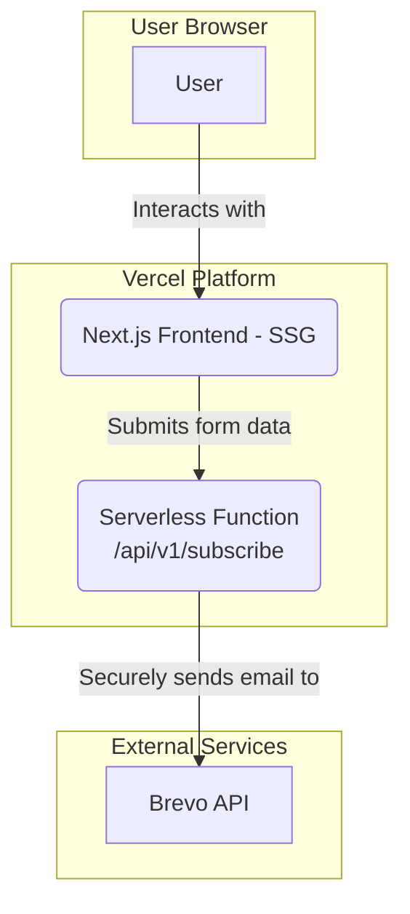

# 2. High Level Architecture

## Technical Summary
The architecture for "Quando um amor se vai" is a modern, **serverless Jamstack** solution designed for high performance, low cost, and maintainability. The frontend is a multi-page static site built with **Next.js** and styled with **Tailwind CSS**, hosted on Vercel's global edge network. User interactions (email form submissions) are handled by a reusable and secure serverless function (a Next.js API route) that accepts parameters to direct subscriptions to the appropriate audience list in the external **Brevo API**. This approach ensures API credentials, managed via Vercel's environment variables, are never exposed on the client side. The entire system uses a shared-type monorepo to ensure data consistency between the frontend and backend, all deployed via an automated Git-based CI/CD workflow.

## Platform and Infrastructure Choice
* **Platform:** Vercel. Chosen for its seamless integration with Next.js and its generous free tier, meeting the core "cost-effectiveness" constraint.
* **Key Services:** Global Static Hosting, Serverless Functions, Integrated CI/CD.
* **Deployment Host and Regions:** Vercel's global edge network.

## Repository Structure
* **Structure:** Monorepo. The default Next.js project structure co-locates the frontend and serverless backend logic within a single repository, simplifying development and deployment.

## High Level Architecture Diagram

## Architectural Patterns

* **Serverless Architecture:** Backend logic is encapsulated in cost-effective, auto-scaling serverless functions.
* **Static Site Generation (SSG):** Pages are pre-rendered at build time for maximum performance, security, and SEO benefits.
* **API Façade:** The serverless function abstracts the Brevo API and protects sensitive credentials.
* **Component-Based UI:** The UI will be built from small, reusable components.
* **Shared-Type Monorepo Pattern:** Utilizes a shared package within the monorepo for TypeScript types (e.g., for form payloads) to ensure data consistency and type safety between the frontend and the serverless function's expected input.
