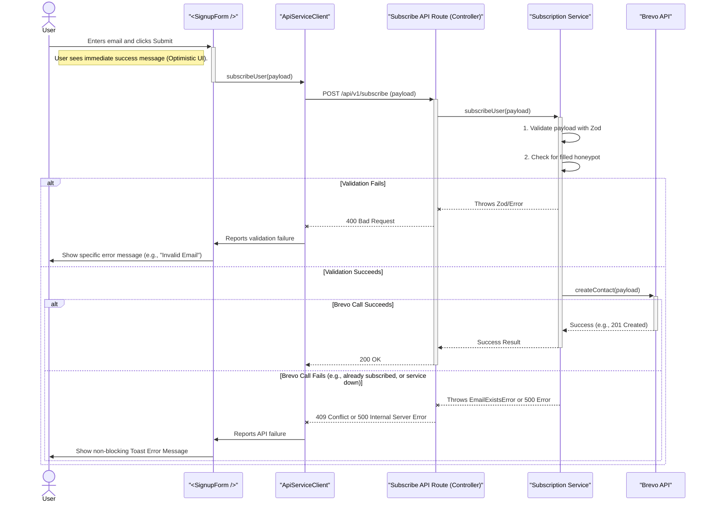

# 8. Core Workflows

## User Subscription Workflow (All Paths)

```mermaid
sequenceDiagram
actor User
participant Form as "<SignupForm />"
participant Client as "ApiServiceClient"
participant Server as "Subscribe API Route (Controller)"
participant SubsService as "Subscription Service"
participant Brevo as "Brevo API"

User->>+Form: Enters email and clicks Submit
note right of User: User sees immediate success message (Optimistic UI).
Form->>-Client: subscribeUser(payload)
Client->>+Server: POST /api/v1/subscribe (payload)
Server->>+SubsService: subscribeUser(payload)
SubsService->>SubsService: 1. Validate payload with Zod
SubsService->>SubsService: 2. Check for filled honeypot

alt Validation Fails
    SubsService--xServer: Throws Zod/Error
    Server--xClient: 400 Bad Request
    Client->>Form: Reports validation failure
    Form->>User: Show specific error message (e.g., "Invalid Email")
else Validation Succeeds
    SubsService->>+Brevo: createContact(payload)
    alt Brevo Call Succeeds
        Brevo-->>-SubsService: Success (e.g., 201 Created)
        SubsService-->>-Server: Success Result
        Server-->>-Client: 200 OK
    else Brevo Call Fails (e.g., already subscribed, or service down)
        SubsService--xServer: Throws EmailExistsError or 500 Error
        Server--xClient: 409 Conflict or 500 Internal Server Error
        Client->>Form: Reports API failure
        Form->>User: Show non-blocking Toast Error Message
    end
end
```
