# PDF Personalization Integration - Visual Diagrams

This document contains detailed visual diagrams for the PDF personalization and Brevo integration system. These diagrams complement the main architecture document ([15-pdf-personalization-integration.md](./15-pdf-personalization-integration.md)).

## System Context Diagram


## Detailed Subscription Flow - Vets with PDF


## Error Handling Flow


## PDF Generation Process Detail


## Deployment Architecture

```mermaid
graph TB
    subgraph Vercel Global Edge Network
        direction TB

        subgraph Region: Global CDN
            CDN[Static Pages<br/>Tutors, Vets, Home]
        end

        subgraph Serverless Functions<br/>Region: Auto-selected
            SF1[/api/v1/subscribe<br/>512MB, 10s timeout]
            SF2[/api/v1/pdf/download<br/>256MB, 10s timeout]
        end

        subgraph Assets<br/>Bundled in Deployment
            A1[Template PDF<br/>public/assets/]
            A2[Fonts<br/>public/fonts/]
        end
    end

    subgraph External Services
        B1[Brevo Contacts API<br/>api.brevo.com]
        B2[Brevo Email API<br/>api.brevo.com]
    end

    subgraph Vercel Environment
        ENV[Environment Variables<br/>BREVO_API_KEY<br/>BREVO_VET_WELCOME_TEMPLATE_ID<br/>JWT_SECRET]
    end

    CDN -.serves.-> Users
    SF1 --> A1
    SF1 --> A2
    SF1 --> B1
    SF1 --> B2
    SF2 --> A1
    SF2 --> A2
    ENV -.config.-> SF1
    ENV -.config.-> SF2

    B2 -.email delivery.-> Users[End Users]

    style SF1 fill:#ff6b6b
    style SF2 fill:#feca57
    style ENV fill:#48dbfb
    style B1 fill:#4ecdc4
    style B2 fill:#4ecdc4
```

## Data Flow - Brevo Contact Attributes


## Performance Optimization - Cold vs Warm Start


## Integration Options Comparison


## Security Layers

```mermaid
flowchart TD
    U[User Request] --> L1{Layer 1:<br/>Input Validation}

    L1 -->|Reject| R1[❌ 400 Invalid Input]
    L1 -->|Pass| L2{Layer 2:<br/>Honeypot Check}

    L2 -->|Reject| R2[❌ 400 Bot Detected]
    L2 -->|Pass| L3{Layer 3:<br/>Temporal Validation}

    L3 -->|Reject| R3[❌ 400 Too Fast/Slow]
    L3 -->|Pass| L4{Layer 4:<br/>Behavioral Check}

    L4 -->|Reject| R4[❌ 400 No Human Behavior]
    L4 -->|Pass| L5{Layer 5:<br/>Rate Limiting}

    L5 -->|Reject| R5[❌ 429 Rate Limited]
    L5 -->|Pass| L6{Layer 6:<br/>API Key Auth}

    L6 -->|Reject| R6[❌ 401 Unauthorized]
    L6 -->|Pass| L7[✅ Process Request]

    L7 --> L8{Layer 7:<br/>Output Sanitization}
    L8 --> Success[✅ Secure Response]

    style L1 fill:#e3f2fd
    style L2 fill:#e3f2fd
    style L3 fill:#e3f2fd
    style L4 fill:#e3f2fd
    style L5 fill:#e3f2fd
    style L6 fill:#e3f2fd
    style L8 fill:#e3f2fd
    style Success fill:#c8e6c9
    style R1 fill:#ffcdd2
    style R2 fill:#ffcdd2
    style R3 fill:#ffcdd2
    style R4 fill:#ffcdd2
    style R5 fill:#ffcdd2
    style R6 fill:#ffcdd2
```



## Testing Strategy Pyramid


---

## Quick Reference: Component Locations

| Component | File Path | Responsibility |
|-----------|-----------|----------------|
| **Subscription API** | `src/app/api/v1/subscribe/route.ts` | HTTP handler, error mapping |
| **Subscription Service** | `src/services/subscriptionService.ts` | Business logic, Brevo integration |
| **PDF Service** | `src/services/pdfPersonalization.ts` | PDF generation, watermarking |
| **Shared Schemas** | `src/shared/schemas.ts` | Zod validation schemas |
| **Bot Detection Config** | `src/config/botDetection.ts` | Bot detection thresholds |
| **Template PDF** | `public/assets/apoio-momentos-dificeis.pdf` | Original PDF template |
| **Fonts** | `public/fonts/FiraSans-*.ttf` | Custom fonts for PDF |

---

**Document Version**: 1.0
**Last Updated**: 2025-10-09
**Related**: [PDF Personalization Architecture](./15-pdf-personalization-integration.md)
