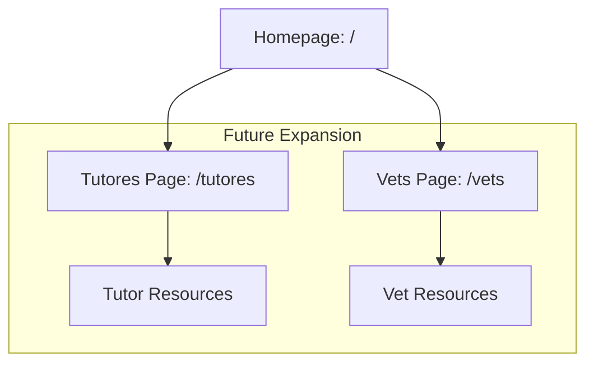
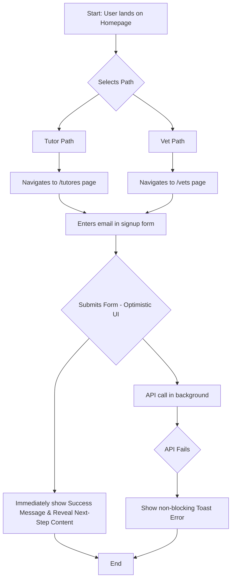

Of course. Here is the complete UI/UX Specification document, consolidating all of the refinements we've collaboratively developed.

```markdown
# Quando um amor se vai UI/UX Specification

## Introduction
This document defines the user experience goals, information architecture, user flows, and visual design specifications for the "Quando um amor se vai" project's user interface. It serves as the foundation for visual design and frontend development, ensuring a cohesive and user-centered experience.

### Change Log
| Date | Version | Description | Author |
| :--- | :--- | :--- | :--- |
| 2025-10-06 | 1.0 | Initial draft and collaborative refinement | Sally (UX Expert) |

### Overall UX Goals & Principles
**Target User Personas**
* **Tutores:** Grieving pet owners and their families who need a supportive, non-clinical space.
* **Veterinarians:** Professionals seeking resources related to pet loss and client support.

**Usability Goals**
* **Ease of Learning:** First-time visitors should immediately understand how to find the content relevant to them.
* **Efficiency of Use:** The design should guide users to their respective content paths with minimal clicks and no confusion.
* **Clarity:** The separation between Tutor and Vet content must be unambiguous.

**Design Principles**
* **Compassionate Minimalism:** The design will be clean and uncluttered, creating a calm, supportive digital space that respects the user's emotional state.
    * **Technical Implementation:** Optimize for Core Web Vitals with a low asset footprint and minimal client-side JavaScript.
    * **User-Centric Guardrail:** Performance must serve the goal of a calm, supportive experience. All visual feedback—such as loading spinners, skeletons, and page transitions—must be smooth and subtle. The goal is a calm experience, not just a fast one.
* **Clarity Through Segmentation:** The core user journey is self-selection. The design must make the choice between "Tutor" and "Vet" paths immediately clear and effortless.
    * **Technical Implementation:** Use a robust theming mechanism (likely CSS custom properties) scoped by the current route segment (`/tutores` vs. `/vets`).
    * **User-Centric Guardrail:** The primary goal is a clear and unambiguous user journey. Prioritize consistent and predictable UI patterns for the user above all else.
* **Trustworthy Professionalism:** The aesthetic will be professional and polished to build trust and signal the credibility of the information provided.
    * **Technical Implementation:** Enforce HTTPS, use frontend error boundaries, and include robust server-side validation.
    * **User-Centric Guardrail:** Errors, whether client-side or server-side, must be communicated to the user in a gentle, non-technical, and reassuring way.
* **Mobile-First by Default:** Every design decision will be made for the mobile experience first, ensuring excellence for the majority of users.
    * **Technical Implementation:** Build all components using responsive patterns enforced by Tailwind CSS, developing for a mobile viewport first.
    * **User-Centric Guardrail:** The desktop experience should be an enhancement of the mobile experience, not a separate design.

## Information Architecture (IA)

### Site Map / Screen Inventory


### Navigation Structure (Refined)

* **Logo as a Home Link:** The shared `<Layout>` component must include the project's logo in the top-left corner, which always links back to the Homepage (`/`).
* **Shared Footer:** The shared `<Layout>` component must include a simple, shared `<Footer>`. For the MVP, this footer will contain a "toggle" link to the alternate section (e.g., on the `/tutores` page, the footer will have a link to the `/vets` page, and vice-versa).

## User Flows

### User Path Selection & Email Signup

* **User Goal:** A visitor, whether a pet owner or a veterinarian, wants to identify their correct path, access the relevant content, and sign up for the email list.
* **Entry Points:** Direct navigation to the homepage (`/`).
* **Success Criteria:** The user successfully submits their email, sees a confirmation message, and is presented with next-step content.

#### Flow Diagram



* **Error Handling (Refined):**
  * **Invalid Email:** Client-side validation displays a simple error message.
  * **API Failure:** The UI uses an "Optimistic" approach. Success is shown immediately. If the background API call fails, a non-blocking toast notification appears, asking the user to try again.
  * **Specific Errors:** The API will return structured JSON errors (e.g., for `EMAIL_ALREADY_EXISTS`). The frontend will display a specific, helpful message for these cases.
* **Progressive Disclosure:**
  * Upon successful signup, the success message is shown, and a new content section is revealed below it, providing immediate value and a path for further engagement (e.g., links to sample resources).

## Wireframes & Mockups

This section provides low-fidelity wireframe descriptions. The final, high-fidelity mockups will be created in a design tool (e.g., Figma) and linked here.

* **Primary Design Files:** \[Placeholder for link to Figma project\]

### Key Screen Layouts

**1. Homepage (**`/`)

* **Purpose:** To establish a calm, professional, and branded emotional connection before guiding the user to their correct path, while providing enough content for SEO.
* **Key Elements:**
  * **Initial Viewport (**`min-height: 100vh`):
    * **Branded Illustration:** A subtle, low-opacity, `aria-hidden="true"` "continuous line, minimalist black pen line drawing" as a background element.
    * **Logo:** Top-left corner.
    * **Empathetic Headline (**`<h1>`): A large, central headline.
    * **Supporting Text (**`<p>`): Short sentence below the headline.
    * **Path Selection Buttons:** Two equally weighted buttons ("For Grieving Pet Owners" and "For Veterinary Professionals").
    * **Hybrid User Guide:** A small, tertiary line of text below the buttons to guide veterinarians who are also grieving.
  * **Below the Fold (for SEO & context):**
    * A simple content section with summaries of the site's mission and resources for each audience, including relevant keywords.
  * **Footer:** A simple footer with a distinct background color to avoid a "false bottom" effect.

**2. Tutores Page (**`/tutores`) & Vet Page (`/vets`)

* **Purpose:** To provide a focused, supportive space for the target audience and guide them to sign up.
* **Key Elements:**
  * **Shared Layout:** Includes the persistent Logo and Footer.
  * **Page Headline (**`<h1>`): Audience-specific headline.
  * **Introductory Paragraph (**`<p>`): Audience-specific introductory text.
  * **Signup Form Section:** The central focus of the page.
* **Theming:**
  * **Tutores Page (**`/tutores`): Uses the **dark theme**.
  * **Vet Page (**`/vets`): Uses the **green theme**.
* **Post-Signup Content:** Upon successful form submission, the form is replaced with a success message and a new section with links to starter resources is revealed.

## Component Library / Design System

* **Design System Approach:** For the MVP, we will create a small, bespoke set of reusable components, avoiding large third-party libraries to maintain a lean codebase.
* **Core Components:**
  * **Button:** A polymorphic component built with `cva` that can render as a `<button>` or a Next.js `<Link>`. It supports variants for style (`primary`) and `size` (`sm`, `default`, `lg`) and has defined `hover`, `focus-visible`, and `disabled` states.
  * **Form Field System:** A composite component system (`<FormField>`, `<FormLabel>`, `<FormControl>`, `<FormMessage>`) that uses React Context to automatically handle `id` and `aria-*` attributes, ensuring all form fields are accessible by default.
  * **Layout:** A shared component that wraps all page content, renders the `<Header>` and `<Footer>`, and accepts a `theme` prop to apply route-based styling.

## Branding & Style Guide

* **Visual Identity:** The style is defined by "continuous line, minimalist black pen line drawings" from the project's ebook.
* **Color Palette:** A set of HSL-based color tokens defined as CSS variables, with overrides for `.theme-dark` and `[data-theme="green"]` themes. All color combinations must pass WCAG AA contrast ratios.
* **Typography:**
  * **Headings:** Castoro (Google Font), `font-variant: small-caps`.
  * **Body/UI:** Fira Sans (Google Font).
  * Styling for prose is handled by the `@tailwindcss/typography` plugin.
* **Spacing:** An 8-point grid system is used, configured via `tailwind.config.js`.

## Accessibility Requirements

* **Compliance Target:** WCAG 2.1 Level AA.
* **Guiding Principle:** **Compliance is the floor, not the ceiling.** The goal is not just to pass tests but to create a genuinely good and usable experience for users of assistive technologies.
* **Key Requirements:**
  * Full keyboard navigability.
  * Animations must respect `prefers-reduced-motion`.
  * Semantic HTML must be used.
  * Decorative SVGs must be hidden from screen readers with `aria-hidden="true"`.
  * Focus must be programmatically managed after asynchronous UI updates (e.g., after form submission).
* **Testing Strategy:** A three-layered strategy including static analysis (`eslint-plugin-jsx-a11y`), automated runtime testing (`jest-axe`, `cypress-axe`), and enforced manual checks (via a PR template) for keyboard and screen reader usability.

## Responsiveness Strategy

* **Principle:** **Context-Aware Adaptation.** While the default is mobile-first, the desktop experience will adapt to the user's likely context.
  * **Tutores Section:** The spacious, single-column layout works well for the personal context on all screen sizes.
  * **Vets Section:** On desktop, the layout will prioritize information density to better suit a professional, task-oriented context.
* **Breakpoints:** Uses Tailwind CSS defaults (`sm`, `lg`, `xl`).
* **Implementation:** Layouts use a max-width container to prevent stretching on wide screens. All images must be rendered via the `next/image` component to ensure optimization and prevent Cumulative Layout Shift (CLS).

## Animation & Micro-interactions

* **Principles:** Motion must be Subtle, Purposeful, Performant, and Accessible.
* **Key Animations:**
  * **Homepage Entrance:** A gentle, staggered fade-in/slide-up for text.
  * **Page Transitions:** A seamless cross-fade between pages handled by `Framer Motion`, with `useReducedMotion` to disable it for accessibility.
  * **Micro-interactions:** Smooth color transitions on button hover states.

## Performance Considerations

* **Goals:** Lighthouse score of 95+, LCP < 2.5s, INP < 200ms, CLS < 0.1.
* **Guiding Principle:** Optimize for both *measured* performance (Lighthouse) and *perceived* performance (the human feeling of speed).
* **Strategies:**
  * **Proactive Budgeting:** Use `lighthouse-ci` in the CI/CD pipeline to block PRs that cause performance regressions.
  * **Rendering:** Use Static Site Generation (SSG) for all MVP pages.
  * **Assets:** Use `next/font` and `next/image` for optimized loading.
  * **Perceived Performance:** Implement "Optimistic UI" for form submissions and seamless, overlapping page transitions.

## Next Steps

* **Immediate Actions:**

  
  1. Review this specification with all key stakeholders for final sign-off.
  2. Begin creating high-fidelity visual mockups in Figma based on this document.
  3. Hand this document off to the Architect to create the detailed `architecture.md`.
  4. Create an interactive prototype to test the primary user flow.
* **Design Handoff Checklist:**
  - [x] All user flows documented
  - [x] Component inventory complete
  - [x] Accessibility requirements defined
  - [x] Responsive strategy clear
  - [x] Brand guidelines incorporated
  - [x] Performance goals established

<!-- end list -->

```

This completes our collaborative session. The final document is a comprehensive blueprint for building a high-quality, user-centered application.
```


